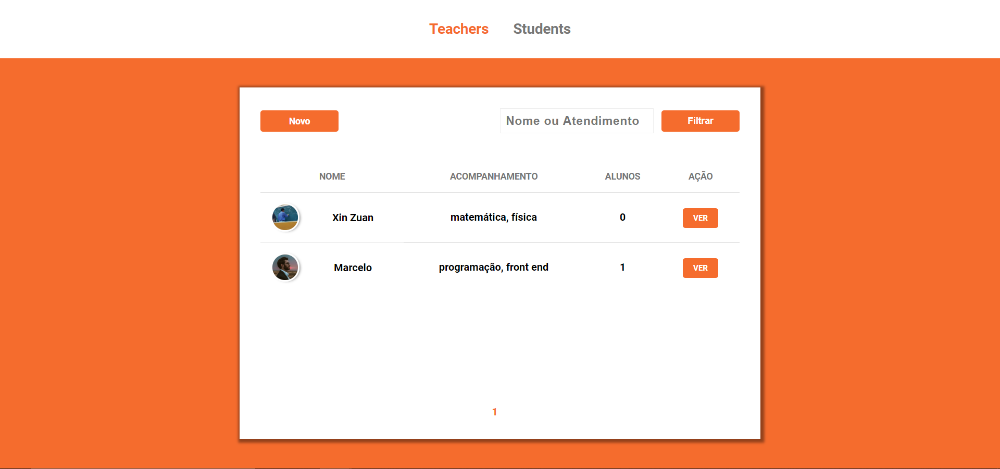
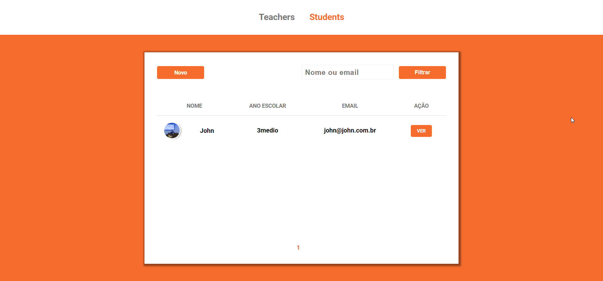

# MY CLASS
A website for private classes. Perfect for teachers who love teaching and for students who love learning | Reach your goals faster with **MY CLASS**

<h1 align="center">
    
</h1>

<h1 align="center">
    
</h1>

</h4>
<p align="center">
  
  

  
	
  <a href="https://www.linkedin.com/in/marcelogaldino/">
    
  </a>

  <a href="https://github.com/marcelogaldino/myclass/commits/master">
    
  </a>

  
   <a href="https://github.com/marcelogaldino/myclass/stargazers">
    
  </a>
</p>

<p align="center">
  <a href="#project">Project</a>&nbsp;&nbsp;&nbsp;|&nbsp;&nbsp;&nbsp;
  <a href="#rocket-Technologies">Technologies</a>&nbsp;&nbsp;&nbsp;|&nbsp;&nbsp;&nbsp;
  <a href="#how-to-use">How to use</a>&nbsp;&nbsp;&nbsp;|&nbsp;&nbsp;&nbsp;
  <a href="#-how-to-contribute">How to contribute</a>&nbsp;&nbsp;&nbsp;|&nbsp;&nbsp;&nbsp;
  <a href="#memo-license">License</a>
</p>

## Project

My class is a project that helps people either students or teachers reach your goals, by learning or teaching :) 

## :rocket: Technologies

This project was developed with the following technologies:

- [Javascript][javascript]
- [HTML][html]
- [CSS][css]
- [Nunjucks][Nunjucks]
- [NodeJS][Node]
- [Postgres][Postgres]

## How To Use

To clone and run this application, you'll need [Git](https://git-scm.com) *(only when using Git CLI)*, [Node.js](https://nodejs.org/), [Postgres](https://www.postgresql.org/) or other SQL Database installed on your computer.

From your command line:

```bash
# Clone this repository
$ git clone https://github.com/marcelogaldino/myclass
```
## Running the project

```bash
# Go into directory server/
$ cd myclass
# Install dependencies
$ npm install
# Run the server
$ npm start
```
## Configuring the database (Windows users)
```bash
# Using windows cmd, let's create the .env file
$ NUL > .env
# Open VSCode
$ code .
```

## Configuring the database (Unix users)
```bash
# Using systems based on Unix , let's create the .env file
$ touch .env
# Open VSCode
$ code .
```

*Fill the .env file with your database settings as the following example below*

```
DB_USER = "your-user"
DB_PASSWORD = "your-password"
DB_HOST = "your-host 'localhost'"
DB_PORT = your-db-port
DB_DATABASE = "your-database-name"
```


## 🤔 How to contribute

- Make a fork;
- Create a branch with your feature: `git checkout -b my-feature`;
- Commit changes: `git commit -m 'feat: My new feature'`;
- Make a push to your branch: `git push origin my-feature`.

After merging your receipt request to done, you can delete a branch from yours.

You are also free to help this project sending me pull requests and opening issues.

## :memo: License

This project is under the MIT license. See the [LICENSE](https://github.com/marcelogaldino/myclass/blob/master/LICENSE) for details.


Made with ♥ by Marcelo Galdino :wave: [Get in touch!](https://www.linkedin.com/in/marcelogaldino/)

[javascript]: https://developer.mozilla.org/pt-BR/docs/Aprender/JavaScript
[html]: https://developer.mozilla.org/pt-BR/docs/Aprender/HTML
[css]: https://developer.mozilla.org/pt-BR/docs/Aprender/CSS
[Node]: https://nodejs.org/
[Nunjucks]: https://mozilla.github.io/nunjucks/
[Postgres]:[https://www.postgresql.org/]